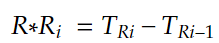
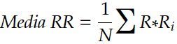
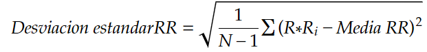
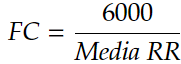

# Análisis de Señal ECG con Filtro Pasa Banda Butterworth y Detección de Picos R

Este proyecto analiza señales de ECG (electrocardiograma) utilizando un filtro pasa banda Butterworth para mejorar la calidad de la señal y detectar picos R con precisión. La información obtenida permite calcular los intervalos R-R, fundamentales para evaluar la variabilidad de la frecuencia cardíaca (HRV). A continuación, se detallan todos los aspectos técnicos, la justificación de los parámetros y las funcionalidades del código.

---

## Parámetros del Proyecto

- **Frecuencia de Muestreo (fs)**: `1000 Hz`
- **Frecuencia de Corte Inferior (`lowcut`)**: `0.5 Hz`
- **Frecuencia de Corte Superior (`highcut`)**: `100 Hz`
- **Orden del Filtro**: `4`
- **Filtrado Causal Doble (`filtfilt`)**: Sí, para eliminar el retardo de fase

---

## Justificación Técnica del Filtro Pasa Banda Butterworth

### 1. Elección del Filtro Butterworth
El filtro **Butterworth** es particularmente adecuado debido a su **respuesta de magnitud plana en la banda de paso**, que minimiza la distorsión en las frecuencias de interés. Esto asegura que las características esenciales del ECG, como los complejos QRS, se mantengan sin alteraciones, lo cual es crucial para la detección de los picos R y el análisis preciso de HRV.

### 2. Frecuencia de Muestreo (`fs = 1000 Hz`)
La **frecuencia de muestreo de 1000 Hz** permite capturar la señal ECG con suficiente detalle, cumpliendo además con el **Teorema de Nyquist** para evitar aliasing. La alta frecuencia de muestreo garantiza:
   - Una resolución temporal adecuada, crucial para identificar de manera precisa los picos R.
   - Estabilidad en los cálculos de variabilidad de la frecuencia cardíaca (HRV) al proporcionar datos detallados.

### 3. Frecuencias de Corte: 0.5 Hz y 100 Hz
El rango de frecuencias **[0.5 Hz - 100 Hz]** permite aislar el contenido relevante de la señal ECG, eliminando el ruido fuera de esta banda.

- **Frecuencia de Corte Inferior (0.5 Hz)**: 
   - Filtra la **deriva de línea de base** y el ruido de baja frecuencia, como el producido por movimientos respiratorios, que podrían interferir en la detección de los picos R.
   - Preserva las frecuencias fundamentales de la señal ECG sin captar variaciones indeseadas.

- **Frecuencia de Corte Superior (100 Hz)**:
   - Reduce el **ruido electromagnético** de alta frecuencia y otras interferencias externas.
   - Mantiene la **morfología del QRS**, necesaria para la detección precisa de picos R y el análisis de intervalos R-R.

### 4. Orden del Filtro (`4`)
Un **filtro de orden 4** proporciona un balance óptimo entre **selectividad** (pendiente de 80 dB/decada) y **estabilidad computacional**. Esto asegura una reducción eficaz del ruido sin perder detalles importantes de la señal.

### 5. Filtrado Causal Doble (`filtfilt`)
Se utiliza la función `filtfilt` para realizar un filtrado causal doble que:
   - **Elimina el retardo de fase**: Esto asegura que la alineación temporal de los picos R no se vea afectada.
   - **Preserva la morfología de la señal**: Garantiza que la forma de la onda ECG se mantenga clara, lo que es crucial para el análisis de HRV.

---

## Procesamiento de la Señal ECG

El proceso de análisis de la señal ECG se divide en cuatro etapas principales:

1. **Aplicación del Filtro Butterworth**: La señal ECG se filtra utilizando el filtro pasa banda Butterworth configurado para eliminar el ruido de baja y alta frecuencia, preservando las frecuencias relevantes para el ECG.

2. **Detección de Picos R**: Se utilizan algoritmos de detección de picos optimizados para capturar los picos R con precisión, basándose en un umbral ajustado al contenido de la señal filtrada. La detección de picos R es fundamental para calcular los intervalos entre latidos.

3. **Cálculo de Intervalos R-R**: Los intervalos R-R se obtienen a partir de la diferencia de tiempo entre los picos R consecutivos, proporcionando la base para el análisis de HRV.

4. **Cálculo de Parámetros de HRV**: Se calculan métricas básicas como la media y desviación estándar de los intervalos R-R, parámetros relevantes en el análisis de variabilidad de la frecuencia cardíaca.

---

## Visualización

El script genera varios gráficos para facilitar el análisis y evaluación del procesamiento de la señal:

- **Señal ECG Original y Filtrada**: Comparación de la señal ECG sin filtrar y la señal filtrada, permitiendo evaluar la efectividad del filtro.
- **Detección de Picos R**: Visualización de la señal filtrada con los picos R marcados.
- **Intervalos R-R**: Gráfico de los intervalos R-R en el tiempo, útil para el análisis de HRV.

---
# Análisis de la Variabilidad de la Frecuencia Cardíaca (HRV)

El análisis de la variabilidad de la frecuencia cardíaca (HRV) en el dominio del tiempo utilizando datos de electrocardiograma (ECG). El análisis de la HRV es fundamental para evaluar la salud cardiovascular y la respuesta del sistema nervioso autónomo. A continuación, se describen los pasos y técnicas utilizados en este análisis.

## Introducción

El análisis de la HRV en el dominio del tiempo se enfoca en calcular parámetros que describen la variabilidad de los intervalos R-R (el tiempo entre picos R consecutivos en un ECG). Este análisis es esencial para evaluar la salud cardiovascular.

## Detección de Picos R

El primer paso en el análisis de HRV es la detección de los picos R en la señal de ECG. Esto se logra mediante:

- **Filtrado de la señal**: Se aplica un filtro (como un filtro Butterworth pasa banda) para eliminar ruidos fuera del rango de interés, típicamente entre 0.5 y 100 Hz.
- **Identificación de picos**: Se utilizan métodos de detección, como `find_peaks` de SciPy, para identificar los picos R con un umbral basado en la media y desviación estándar de la señal filtrada.

## Cálculo de Intervalos R-R

Una vez que se han identificado los picos R, se calculan los intervalos R-R:

- **Intervalos R-R**: Se obtienen restando las posiciones de los picos R adyacentes:

- **Conversión a milisegundos**: Los intervalos R-R se expresan en milisegundos (ms) para facilitar la interpretación.

## Cálculo de Parámetros Estadísticos

Los intervalos R-R se utilizan para calcular varios parámetros estadísticos que describen la HRV:

- **Media de los intervalos R-R**:

- **Desviación estándar de los intervalos R-R**:

 
## Interpretación de Resultados

Los parámetros calculados proporcionan información crítica sobre la salud cardiovascular:

- **Frecuencia Cardíaca**: La media de los intervalos R-R puede ser utilizada para calcular la frecuencia cardíaca (FC) en latidos por minuto (lpm):

- **Variabilidad**: Un aumento en la desviación estándar de los intervalos R-R sugiere una mayor capacidad de adaptación del sistema nervioso autónomo.

## Limitaciones y Consideraciones

- **Calidad de los Datos**: La precisión de los resultados depende de la calidad de la señal de ECG y de la eficacia de la detección de picos.
- **Interpretación Contextual**: Los resultados deben ser interpretados dentro del contexto clínico adecuado y revisados por un profesional de la salud.

## Conclusión

El análisis de la HRV en el dominio del tiempo es una herramienta valiosa para evaluar la salud cardiovascular y la función del sistema nervioso autónomo. Al centrarse en los intervalos R-R y sus propiedades estadísticas, proporciona una visión clara de la variabilidad en la frecuencia cardíaca y su relación con el bienestar general.
